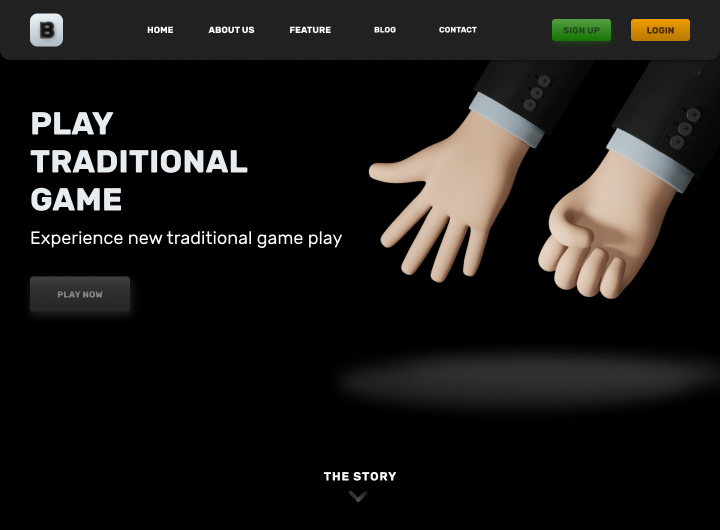

# Backend Stack For Bakergun

Backend stack ini dibuat dengan [NodeJS](https://nodejs.org), [ExpressJS 🚀](https://expressjs.com) dan Templating Engine[EJS](https://ejs.co/)

Pelayanan (**_serving_**) apa yang ada di dalam project ini? file berextensi .json untuk keperluan **RestAPI**(**Re**presentational **S**tate **T**ransfer **A**pplication **P**rogramming **I**nterface) ke [Front-End](https://github.com/sanengineer/backergun)

## Build UI with Templating Engine EJS

Rendering html document secara terpisah menggunakan templating view engine EJS.

Figma Design UI link : [Bakergun UI Design](https://www.figma.com/file/LcJvUL3iMNdFZ9lsLu0XHq/Bakergun-UI-3D-Models-UI-UX?node-id=0%3A1)

## How To Run Server ?

### First,

`$ cd bakergun-backend`

### Last,

`$ npm start`

## Development Guide

### Required :

- [Watch Sass](https://marketplace.visualstudio.com/items?itemName=ritwickdey.live-sass) Plugin, to editing stylesheet.

---

#### Credit :

- Roy Thomas Fielding, [disertasi](https://www.ics.uci.edu/~fielding/pubs/dissertation/top.htm)nya.
